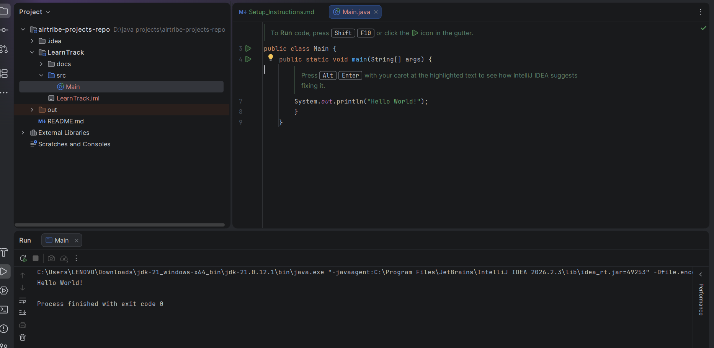

JDK-Version = jdk-21.0.12.1

Hello World Program Run:-

1. Public Class ui.Main :-
    a) This defines the java class name as ui.Main Class.
    b) We save this as ui.Main.java file.
2. public static void main(String[] args)
   a) This is the main method.
   b) Java starts program execution from the main() method.
   c) public → accessible by JVM.
   d) static → JVM can call it without creating an object.
   e) void → doesn't return anything.
   f) String[] args → accepts command-line arguments.
3. System.out.println("Hello World!")
   a) Prints Hello World to the console.
   b) System.out represents the standard output.
   c) println() prints the text and moves to the next line.

